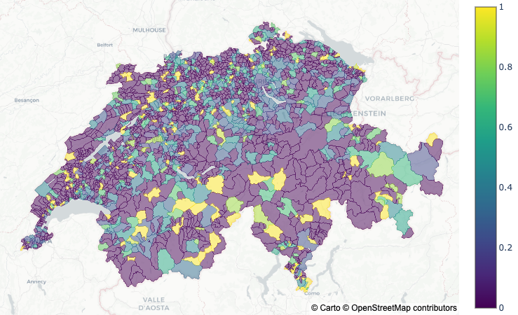

# MIGROS STORES CHALLENGE

## Project Introduction
   The purpose of this project was to identify the locations of Migros supermarkets and their competitors in Bern, Switzerland in order to find potentially interesting places to construct new Migros supermarkets. We broke down the problem into 3 steps:
    
   1.Retrieve the supermarket locations via Google Maps API.
    
   2.Plot them on Google Maps.
    
   3.Analyze market opportunities based on the density of existing stores, presence of competitors, and general population density to inform Migros’ development strategy.

### Technologies Used
* Python
* APIs, JSON
* Web scraping
* Pandas, jupyter
* Plotly
* Visualisation and mapping

## Project Description

### 1.Retrieve locations via Google Maps API:
   Here we wanted to get the list of locations of all migros stores and its main compitetors Coop, Lidl, Aldi in switzerland. To extract information from Google Maps we need access to Google Maps API. In order to get access to the Google Maps API, a Google API key is required. 
    Once the API key was available, we used Requests packages for web scraping/crawling. Requests is a package that lets us make http requests. In the context of web scraping, it allows us to get the content of a webpage, that can be further analyzed using a html parser.
    The data we scraped from web, we further cleaned it using pandas package and made it ready for further steps.
    
### 2.Plot them on Google Maps:
   Using plotly package we plotted the supermarkets in swiss, which helps us to get an idea for further classification.
    It looked as following:

    
### 3.Analyze market opportunities based on the density of existing stores, presence of competitors, and general population density to inform Migros’ development strategy.

We demonstrated out Visualization using Chloropleth Map. A Choropleth Map is a map composed of colored polygons. It is used to represent spatial variations of a quantity. 
   
   1.Analysing by the poulation in the Communes in percent ,by the average income for the Kanton of Zürich, GDP per Kantone.
   
   This is the plot which shows how population is distributed among switzerland

   
   Average Income of Zurich canton 

   
   GDP per Kantone 

  
  
   2.Approach through presence of other stores (competitors)in each Commune
   
   Showing the N number of Supermarkets per 1000 residents

   
   Showing only the big chain supermarkets per 1000 residents

## Conclusion
   Based on the above analysis, it was estimated that there might be population increase in future in particualar areas. Hence we recommended to locate Migros stores in Zürich , Nothern Bern and Basel canton area.

